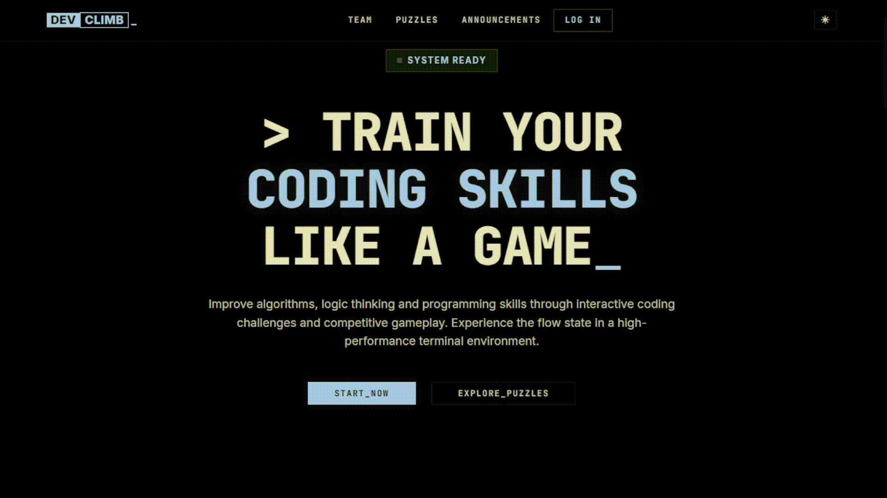

=========================================
  DEVCLIMB
  Competitive Coding Puzzle Platform
=========================================

DevClimb is a web-based coding challenge platform where users solve programming
puzzles, form teams, compete in timed contests, and earn trophies. Project
features and functions largely inspired by Leetcode, built from scratch with
a terminal UI.

Built with Java servlets on the backend and vanilla HTML/CSS/JS on the frontend.

  

About
-----
DevClimb is a FPT Polyschool project done by LBKT Studio team (PRO230). The
project is a fully functional platform with real-time code execution, team
management, admin tools, and a contest system with leaderboards.

Users can sign up via email or OAuth (Google/GitHub), join or create teams,
browse puzzles by difficulty, write and submit code in an in-browser editor,
and see their results instantly. Contests add a competitive layer with timed
challenges and trophy rewards.

Features
--------

  Puzzles & Code Execution
  Write code directly in the browser using a CodeMirror editor. Submit and
  get instant feedback powered by Judge0, see which test cases passed, how
  long your code took, and any errors. Supports Python, JavaScript, and PHP.

  [Screenshot: Code editor with test case results]

  Contests & Trophies
  Admins create timed contests containing multiple puzzles. Solve all puzzles
  before the contest ends to earn a trophy. The Hall of Fame tracks the
  fastest solvers, most active participants, and shortest code solutions.

  [Screenshot: Contest listing page with Hall of Fame]

  [Screenshot: Trophy reward popup]

  Teams
  Form teams with friends, see each other's progress, and climb the
  leaderboards together. Teams can be public or private, with editable
  profiles and shoutouts.

  [Screenshot: Team page with members and stats]

  Profiles & Rankings
  Every user has a profile showing their rank, total score, completed
  puzzles, team affiliation, and activity history.

  [Screenshot: User profile page]

  Announcements
  Admins post announcements with different categories (maintenance, release,
  feature, etc.) that show up as a banner across the site.

  [Screenshot: Announcement page]

  Admin Dashboard
  Full management panel for users, teams, puzzles, contests, trophies,
  warnings, and announcements. Includes analytics charts showing solve
  activity over time.

  [Screenshot: Admin dashboard with charts]

  [Screenshot: Admin puzzle/contest management]

  Moderation
  Admins can issue time-bound warnings, ban users or teams, and review
  appeals. A maintenance mode flag can temporarily restrict access to
  non-admin users.

  Dark & Light Theme
  Toggle between dark and light modes. Your preference is saved locally.

  [Screenshot: Dark mode vs light mode side by side]

Tech Stack
----------

  Backend
    Java 21, Jakarta Servlet 6.0, Hibernate/JPA, MySQL 8, Maven, REST API

  Frontend
    Vanilla HTML/CSS/JS (no framework), GSAP, CodeMirror, Chart.js

  Auth
    Firebase Authentication (Email/Password, Google, GitHub OAuth)

  Storage
    Cloudflare R2 for image uploads (avatars, contest banners)

  Code Execution
    Judge0 CE API (Community Edition)

  Database
    MySQL 8 hosted on Aiven Cloud

Getting Started
---------------

  Prerequisites
    - Java 21
    - Maven 3.9+
    - Apache Tomcat 11
    - A MySQL 8 database
    - A Firebase project with Authentication enabled
    - A Cloudflare R2 bucket for file uploads
    - A Judge0 CE instance for code execution

  1. Clone the repo

  2. Set up configuration files (all gitignored):
       backend/src/main/resources/META-INF/persistence.xml
         -> Database URL, username, password
       backend/src/main/resources/firebase-service-account.json
         -> Firebase Admin SDK credentials
       backend/src/main/resources/r2.properties
         -> Cloudflare R2 access key, secret, bucket, endpoint
       backend/ca-truststore.jks
         -> SSL truststore for Aiven DB connection
       frontend/utils/constants.js
         -> API_BASE URL and Firebase web config

  3. Build and run the backend:
       mvn clean package cargo:run -f backend/pom.xml

  4. Serve the frontend directory with any static file server
     (e.g., VS Code Live Server on port 5500)

  [Screenshot: Terminal running mvn cargo:run]

Project Layout
--------------

  backend/
    src/main/java/
      controller/     22 servlet controllers
      entity/         13 JPA entity classes
      dao/            11 data access objects
      filter/         CORS and admin auth filters
      service/        Firebase auth service
      util/           Database, responses, file upload, code execution

  frontend/
    assets/css/       Design tokens, reset, components, theme styles
    components/       Reusable UI components (navbar, tables, popups, etc.)
    services/         API service modules (thin wrappers per resource)
    utils/            Config constants
    pages/
      common/         Shared pages (login, announcements, maintenance)
      guest/          Public pages (browse puzzles, teams, profiles)
      user/           Authenticated pages (home, solve, contests, settings)
      admin/          Admin panel (dashboard, contest creation)

  [Screenshot: Project file structure]

Database
--------
  13 tables: user, team, puzzle, language, contest, testcase, progress,
  trophy, user_trophy, warning, appeal, announcement, maintenance

  Hibernate auto-creates and updates the schema on startup (hbm2ddl=update).

How Code Execution Works
------------------------
  1. User writes a function in the browser editor
  2. Frontend sends the code + function name to the backend
  3. Backend wraps the code in a template (reads JSON from stdin, calls the
     user's function)
  4. Wrapped code is sent to Judge0 CE along with test cases
  5. Backend polls for results, parses pass/fail per test case
  6. Results are sent back to the frontend for display

  [Screenshot: Submission result showing pass/fail per test case]

Security
--------
  - Firebase token verification for all authenticated requests
  - Session-based auth with fixation protection
  - CORS whitelist (localhost:5500, devclimb.online, api.devclimb.online)
  - Admin endpoints behind a dedicated auth filter
  - 100KB source code length limit per submission
  - All secrets and credentials are gitignored

License
-------
  MIT License - Copyright (c) 2026 LBKT Studio
